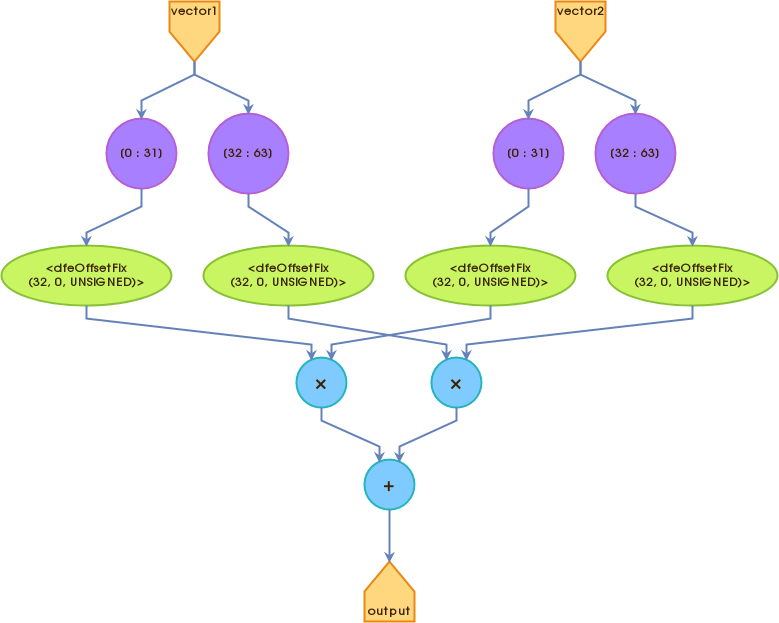

# Scalar Multiplication in Linear Regression
Linear regression, a fundamental algorithm in machine learning, serves as a robust method for modeling relationships between dependent and independent variables. Central to its implementation is the concept of scalar multiplication, a critical operation that significantly influences the optimization of model coefficients, especially during the gradient descent process.

## Linear Regression Equation
The linear regression model seeks to determine the optimal parameters, including coefficients and intercept, to form a line or hyperplane that best fits the relationship between input features (independent variables) and the output variable (dependent variable). The linear regression equation is represented as:
$`y = \beta_0 + \beta_1x_1 + \beta_2x_2 + \ldots + \beta_nx_n`$
Here, $`y`$ denotes the predicted output, $`beta_0`$ is the intercept, and $`(\beta_1, \beta_2, \ldots, \beta_n)`$ represent coefficients associated with respective input features $`(x_1, x_2, \ldots, x_n)`$.

## Training Process
The training process in linear regression involves finding optimal values for the coefficients ($`\beta_0, \beta_1, \ldots, \beta_n`$) to minimize the difference between predicted and actual values of the dependent variable in the training dataset. Scalar multiplication is a key operation during the optimization process, particularly within the widely used gradient descent algorithm.

## Gradient Descent Update Rule
Gradient descent, an iterative optimization algorithm, adjusts coefficients in the opposite direction of the cost function's gradient. The update rule for each coefficient ($`\beta_i`$) in a single iteration of gradient descent is given by:
$`\beta_i = \beta_i - \alpha \frac{\partial J}{\partial \beta_i}`$
Here, $`alpha`$ is the learning rate, and $`(\frac{\partial J}{\partial \beta_i})`$ represents the partial derivative of the cost function $`J`$ with respect to the coefficient $`beta_i`$. Scalar multiplication is instrumental in determining the step size for coefficient adjustments.

## Mean Squared Error Cost Function
The mean squared error ($`J`$) measures the discrepancy between predicted and actual values and is defined as:
$`J = \frac{1}{2m} \sum_{i=1}^{m} (h(x^{(i)}) - y^{(i)})^2`$
Here, $`m`$ is the number of training examples, $`(h(x^{(i)}))`$ is the predicted value for the $`(i^{th})`$ example, and $`(y^{(i)})`$ is the actual output. The partial derivative of this cost function with respect to a specific coefficient $`(\beta_i))`$ is crucial for the gradient descent update rule.

## Incorporating Scalar Multiplication
Scalar multiplication is integrated into the gradient descent update rule to determine the step size for adjusting each coefficient during the optimization process. The term $`(\alpha \frac{\partial J}{\partial \beta_i})`$ governs the magnitude of the update, influencing the adjustment of each coefficient in a given iteration.

## Scalar Multiplication in Maxeller
The VectorsKernel class extends the Maxeler Kernel class and is designed to optimize linear regression operations. 
```java
package vectors;

import com.maxeler.maxcompiler.v2.kernelcompiler.Kernel;
import com.maxeler.maxcompiler.v2.kernelcompiler.KernelParameters;
import com.maxeler.maxcompiler.v2.kernelcompiler.types.base.DFEVar;
import com.maxeler.maxcompiler.v2.kernelcompiler.types.composite.DFEVector;
import com.maxeler.maxcompiler.v2.kernelcompiler.types.composite.DFEVectorType;

class VectorsKernel extends Kernel {

	VectorsKernel(KernelParameters parameters, int vectorSize) {
		super(parameters);

		DFEVectorType<DFEVar> vectorType =
			new DFEVectorType<DFEVar>(dfeUInt(32), vectorSize);

		// Input
		DFEVector<DFEVar> vector1 = io.input("vector1", vectorType);
		DFEVector<DFEVar> vector2 = io.input("vector2", vectorType);
		
		// Output
		DFEVar output = constant.var(0);
		
		for(int i = 0; i < vectorSize; i++){
		    output += vector1[i] * vector2[i];
		}

		io.output("output", output, output.getType());
	}
}
```

Here's a breakdown of the key components:
- The code declares a vector type with 32-bit unsigned integer elements and a specified size. It then declares two input vectors, vector1 and vector2, using the specified vector type.
- An output variable 'output', is declared and initialized with a constant value of 0. This variable will accumulate the result of the scalar multiplication.
- A loop iterates over each element of the input vectors, and scalar multiplication is performed element-wise. The results are accumulated in the output variable, effectively computing the dot product of the two vectors.
- Finally, the computed result is declared as an output port named 'output' with its associated type.

## Execution Graph for a Scalar Multiplication
This section provides an overview of the execution graph for a scalar multiplication within the MaxCompiler application.

### Execution Graph Overview
The execution graph for the scalar multiplication is represented as a series of interconnected nodes and edges, illustrating the flow of computation on the Maxeler platform. 
This graph encapsulates the pipeline of arithmetic units and the orchestrated data flow managed by the MaxCompiler.

### Graph Visualization




### Clone the repository to your local machine.
```bash
git clone https://github.com/dzaja123/Dataflow-HW2-linear-regression-algorithm-Maxeler.git
```

## Conclusion
In summary, scalar multiplication is a critical component in the implementation of linear regression, particularly during the optimization process using gradient descent. The careful integration of scalar multiplication, along with an appropriate learning rate, ensures the convergence of the algorithm and the generation of optimal coefficients for an accurate predictive model. A solid understanding of the mathematical foundations and practical implementation of scalar multiplication in linear regression is crucial for any data scientist or machine learning practitioner.
